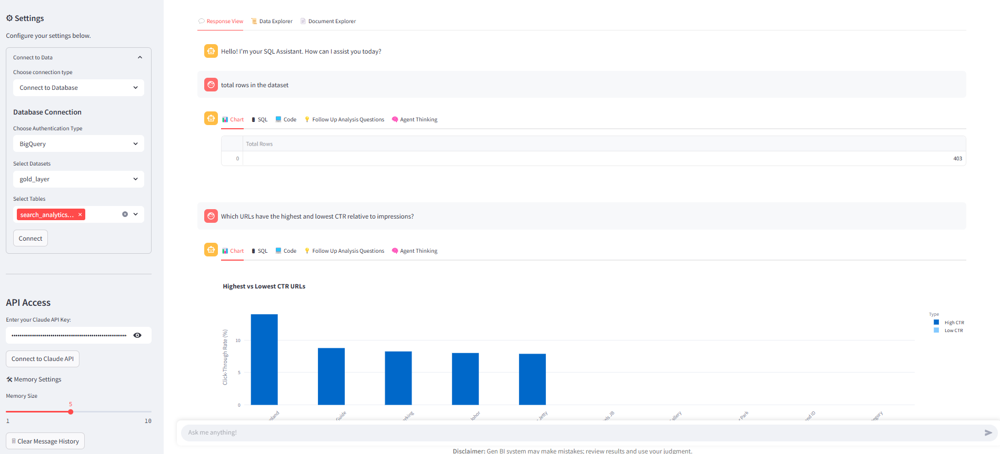
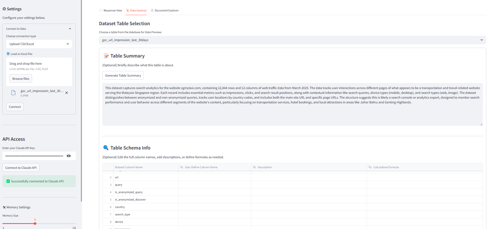
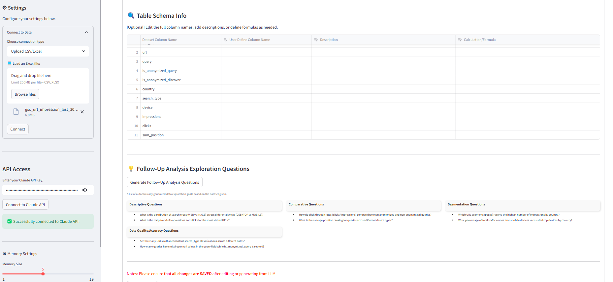

⭐ Star us on GitHub — your support motivates us a lot! 🙏😊

# Table of Contents
- [About](#about)
- [Architecture](#architecture)
- [Key Features](#key-features)
- [Project Structure](#project-structure)
- [Getting Started](#getting-started)
- [Feedback and Contributions](#feedback-and-contributions)
- [Contacts](#contacts)

# About 
## 📊 IntelliQuery BI


**IntelliQuery BI** is an MVP analytics framework that automates and accelerates business intelligence workflows by transforming natural language questions into SQL queries and interactive visualizations. It enables fast, intuitive, and actionable insights. Built with Streamlit and powered by LLMs, the platform provides an intuitive interface for data analysis without requiring technical SQL knowledge.

# Architecture


# Key Features

### 🤖 AI-Powered Natural Language Processing
- **LLMs**: Claude (with more models coming soon).
- **User Interface:** Built with Streamlit for an interactive and user-friendly experience.
- **Backend:** Built by LangChain, with a ReAct agent for output generation and Retrieval-Augmented Generation (RAG) to fetch the most relevant SQL queries from a vector database.

### 📊 Data Connectivity
- **File Upload Support**: CSV and Excel (.xlsx) files
- **Database Connections**:
  - Google BigQuery
  - SQLite 
  - MySQL/SQL Server Authentication

### 🎯 Analytics Features
- **Automated Data Summarization**: AI-generated dataset overviews with semantic types.
- **Smart Question Recommendations**: Automatically suggests relevant analysis questions.
- **Interactive Visualizations**: Plotly-powered charts and graphs.
- **Follow-up Question Generation**: Suggests deeper analysis opportunities.

### 🔍 Intelligent Retrieval (RAG) System
- **Vector Database Integration**: Qdrant-powered similarity search.
- **SQL Query Retrieval**: Stores and retrieves the top-k most relevant question–SQL query pairs based on the user's question.

# Project Structure
```
Gen BI/
│
├── genbi_app.py
├── README.md
├── requirements.txt
│
├── config/
│   ├── __init__.py
│   ├── logger.py
│   ├── service_config.py
│
├── data/
│   ├── const.py
│   └── img/
│       ├── IntelliQuery BI Framework.drawio.png
│       ├── response_tab_ui.png
│       ├── data_tab_ui.png
│       └── doc_tab_ui.png
├── src/
│   ├── excel_loader/
│   │   ├── __init__.py
│   │   ├── excel.py
│   │   ├── unstructured_partition_xlsx.py
│   ├── llm/
│   │   ├── __init__.py
│   │   ├── chat_model.py
│   │   ├── embedding_model.py
│   ├── tools/
│   │   ├── __init__.py
│   │   ├── custom_sql_toolkit.py
│   │   ├── dataset_summary_tool.py
│   │   ├── follow_up_question_tool.py
│   │   ├── output_validator_tool.py
│   │   ├── python_ast_repl_tool.py
│   │   ├── question_recommendation_tool.py
│   ├── ui/
│   │   ├── __init__.py
│   │   ├── data_connection.py
│   │   ├── data_tab.py
│   │   ├── document_tab.py
│   │   ├── response_tab.py
│   │   ├── setup_st_config.py
│   └── utils/
│       ├── __init__.py
│       ├── agent_response_parser.py
│       ├── ingestion.py
│   └── logs/
```

# Getting Started
### Prerequisites
- Python 3.11+
- Google Cloud Service Account (for BigQuery)
- Anthropic Claude API Key
- Qdrant Cloud Account ([Get your API key](https://qdrant.tech/))

### Local Setup

1. **Clone the Repository**
   ```bash
   git clone https://github.com/JennyTan5522/Gen-BI.git
   cd Gen-BI
   ```

2. **Create Virtual Environment**
   ```bash
   python -m venv venv
   # Windows
   venv\Scripts\activate
   # Linux/Mac
   source venv/bin/activate
   ```

3. **Install Dependencies**
   ```bash
   pip install -r requirements.txt
   ```

4. **Environment Configuration**
   Copy the `.env_example` to `.env` in the root directory.

5. **Run the Application**
   ```bash
   streamlit run genbi_app.py
   ```

## Demo Usage Guide
⭐Below are sample UI with IntelliQuery BI’s interface and features:

#### 1. Response Tab



---

#### 2. Data Tab



---

#### 3. Document Tab


---

⭐️ More demo content coming soon. Stay tuned!

# Feedback and Contributions
🤝 We are committed to continuous improvement and value your feedback. Whether you have suggestions, feature requests, or have found a bug, please let us know. You can contribute by submitting an issue or joining the discussions. Every contribution helps us grow and improve.

Thank you for your support!

# Contacts
🗨️ For more information about Gen BI products, services, or general inquiries, please contact us:

Email: jennytan5522@gmail.com